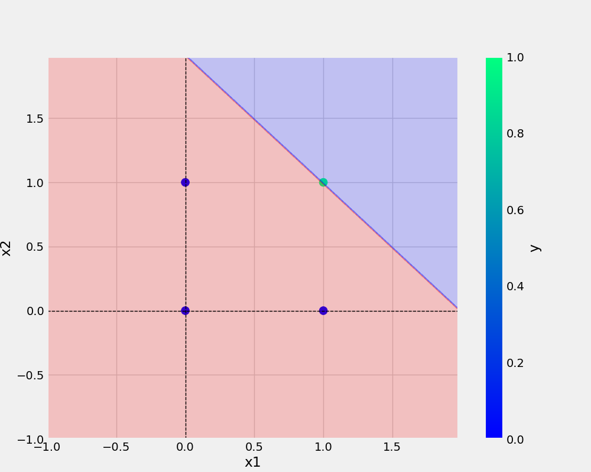
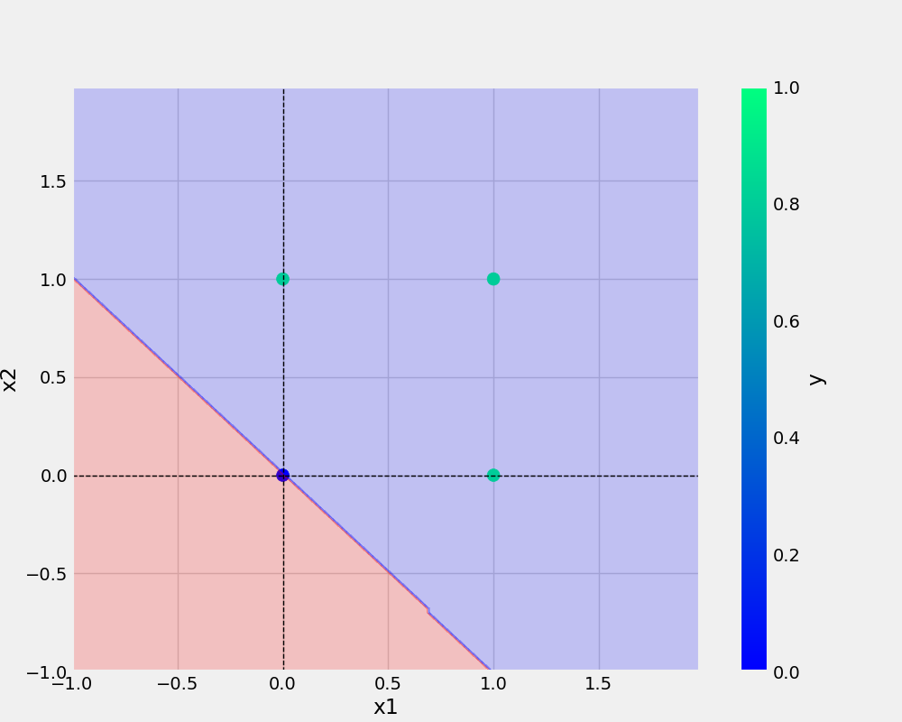

# OneNeuron
OneNeuron|perceptron

## Authors

- [@trmyo](https://github.com/trmyo)

## License

[MIT](https://choosealicense.com/licenses/mit/)

## Commands used to push to github-
``` bash/shell
git add . && git commit -m "docstring updated" && git push origin main
```

## Add URL -
[Git handbook](https://guides.github.com/introduction/git-handbook/)

## Python code 
```python
def main(data, modelName, plotName, eta, epochs):
    df = pd.DataFrame(data)
    print(df)
    X, y = prepare_data(df)
    model = Perceptron(eta=eta, epochs=epochs)
    model.fit(X, y)
    _ = model.total_loss()   # _ means dummy variable...means will be no display
    save_model(model, filename=modelName)
    save_plot(df, plotName, model)

```

## dataset
x1 | x2 | y 
-|-|-
0|0|0
0|1|0
1|0|0
1|1|1

### 
* point 1
* point 2
 

## Add Image


  
